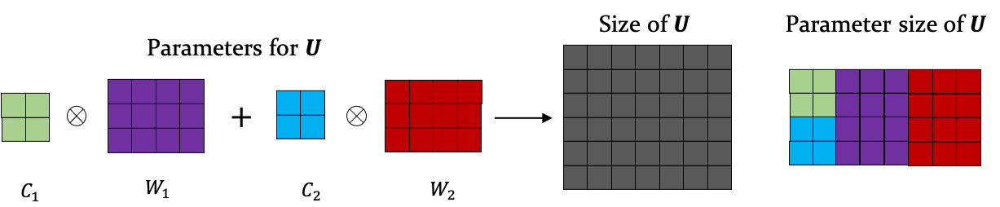
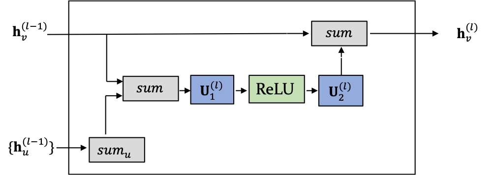

# Parameterized Hypercomplex Graph Neural Networks (PHC-GNNs)

PHC-GNNs (Le et al., 2021): https://arxiv.org/abs/2103.16584

PHM Linear Layer Illustration | PHC-GNN Layer Computation Diagram
---  | ---
 | 


### Overview
Here we provide the implementation of Parameterized Hypercomplex Graph Neural Networks (PHC-GNNs) in [PyTorch Geometric](https://github.com/rusty1s/pytorch_geometric),
along with 6 minimal execution examples in the `benchmarks/` directory.
  
  
This repository is organised as follows:
* `phc/hypercomplex/` contains the implementation of the PHC-GNN with all its submodules. This directory resembles the
`quaternion/` in most cases, with the user-defined phm-dimension `n`. For more details, check the subdirectory README.md
* `phc/quaternion/` contains the implementation for quaternion GNN with all its submodules.  For more details, check the subdirectory README.md
* `benchmarks/` contains the python training-scripts for 3 datasets from [Open Graph Benchmark (OGB)](https://github.com/snap-stanford/ogb) and 3 datasets from 
[Benchmarking-GNNs](https://github.com/graphdeeplearning/benchmarking-gnns). Additionally, we provide 6 bash-scripts
with default arguments to run our models.  

Generally speaking, the `phc/hypercomplex/` subdirectory also includes the quaternion-valued GNN, with the modification to only work on `torch.Tensor` objects.
The `phc/quaternion/` subdirectory was first implemented with the **fixed** rules of the quaternion-algebra, such as how to perform addition, and multiplication which can be summarized in the quaternion-valued affine transformation.
The `phc/hypercomplex/` directory generalizes such operations to work directly on `torch.Tensor` objects, making it applicable to many already existing projects.  
For completeness and to share our initial motivation of this project, we also provide the implementations from the `phc/quaternion/` subdirectory.

### Installation
#### Requirements
To run our examples, the main requirements are listed in the `environment_gpu.yml` file. The main requirements used are the following:
```
python=3.8.5
pytest=6.2.1
cudatoolkit=10.1
cudnn=7.6.5
numpy=1.19.2
scipy=1.5.2
pytorch=1.7.1
torch-geometric=1.6.1
ogb=1.2.4
```

#### Conda
Create a new environment:
```
git clone https://github.com/bayer-science-for-a-better-life/phc-gnn.git
cd phc-gnn
conda env create -f environment_gpu.yml
conda activate phc-gnn
```
Install Pytorch Geometric and this module with pip by executing the bash-script `install_pyg.sh`
```
chmod +x install_pyg.sh
bash install_pyg.sh

#install this library
pip install -e .
```

Run the implemented pytests in the subdirectories, by executing:
```
pytest .
```

### Getting started
Run our example scripts in the `benchmarks/` directory. Make sure to have the `phc-gnn` environment activated.
For more details, please have a look at `benchmarks/README.md`.

### Reference
If you make use of the implementations of quaternion or parameterized hypercomplex GNN in your research, please cite our manuscript:
```
@misc{le2021parameterized,
      title={Parameterized Hypercomplex Graph Neural Networks for Graph Classification}, 
      author={Tuan Le and Marco Bertolini and Frank Noé and Djork-Arné Clevert},
      year={2021},
      eprint={2103.16584},
      archivePrefix={arXiv},
      primaryClass={cs.LG},
      url={https://arxiv.org/abs/2103.16584}
}
```

### License
GPL-3
